# Bulk RNA-seq Time-Course Analysis: ZRN01 Dataset #1 (RM)

<p><strong>Analysis and pipeline prepared by:</strong> Ha-Na Shim</p>
<p><strong>Contact:</strong> hshim1@uchicago.edu for questions, feedback, or suggestions regarding this workflow.</p>

## Tools/packages used

<!-- Horizontal badges -->
[![R][R-badge]][R-url] [![RStudio][RStudio-badge]][RStudio-url] [![pheatmap][pheatmap-badge]][pheatmap-url] [![ggplot2][ggplot2-badge]][ggplot2-url] [![tidyverse][tidyverse-badge]][tidyverse-url] [![nf-core][nfcore-badge]][nfcore-url] [![Snakemake][Snakemake-badge]][Snakemake-url] [![Salmon][Salmon-badge]][Salmon-url] [![Kallisto][Kallisto-badge]][Kallisto-url] [![MultiQC][MultiQC-badge]][MultiQC-url]

<p align="center">

<a href="https://bioconductor.org/packages/DESeq2">
  
</a>
<a href="https://bioconductor.org/packages/clusterProfiler">
  
</a>

<!-- Tidyverse family (official hex-stickers repo) -->
<a href="https://ggplot2.tidyverse.org/">
  
</a>
<a href="https://www.tidyverse.org/">
  
</a>
<a href="https://dplyr.tidyverse.org/">
  
</a>

<!-- Bioconductor hexes -->
</a>
<a href="https://bioconductor.org/packages/edgeR">
  
</a>

</p>

<!-- Badge image refs -->
[R-badge]: https://img.shields.io/badge/R-276DC3?style=for-the-badge&logo=r&logoColor=white
[RStudio-badge]: https://img.shields.io/badge/RStudio-75AADB?style=for-the-badge&logo=rstudio&logoColor=white
[pheatmap-badge]: https://img.shields.io/cran/v/pheatmap?style=for-the-badge&label=pheatmap
[ggplot2-badge]: https://img.shields.io/cran/v/ggplot2?style=for-the-badge&label=ggplot2
[tidyverse-badge]: https://img.shields.io/cran/v/tidyverse?style=for-the-badge&label=tidyverse
[nfcore-badge]: https://img.shields.io/badge/nf--core-pipelines-00A98F?style=for-the-badge
[Snakemake-badge]: https://img.shields.io/badge/Snakemake-workflows-3277a8?style=for-the-badge
[Salmon-badge]: https://img.shields.io/badge/Salmon-quantification-ff8066?style=for-the-badge
[Kallisto-badge]: https://img.shields.io/badge/kallisto-quantification-555555?style=for-the-badge
[MultiQC-badge]: https://img.shields.io/pypi/v/multiqc?style=for-the-badge&label=MultiQC

<!-- Link refs -->
[R-url]: https://www.r-project.org/
[RStudio-url]: https://posit.co/products/open-source/rstudio/
[pheatmap-url]: https://cran.r-project.org/package=pheatmap
[ggplot2-url]: https://ggplot2.tidyverse.org/
[tidyverse-url]: https://www.tidyverse.org/
[nfcore-url]: https://nf-co.re/
[Snakemake-url]: https://snakemake.readthedocs.io/
[Salmon-url]: https://combine-lab.github.io/salmon/
[Kallisto-url]: https://pachterlab.github.io/kallisto/
[MultiQC-url]: https://multiqc.info/

## Table of Contents
- [Data & Inputs](#data--inputs)
- [Part 1: Quality control and sample assessment](#part-1-quality-control-and-sample-assessment)
  - [CPM distribution filtering](#cpm-distribution-filtering)
  - [Distribution of counts](#distribution-of-counts)
  - [DESeq2 normalization assessment](#deseq2-normalization-assessment)
  - [Sample-to-sample correlation & dendrogram](#sample-to-sample-correlation--dendrogram)
  - [PCA (± loadings) & Scree](#pca--loadings--scree)
- [Downstream DGE & Functional Analysis (stubs)](#downstream-dge--functional-analysis-stubs)
- [Reproducibility](#reproducibility)

### Required packages and R version

<p><em>The following packages are required to run the workflow and generate the visualizations below.</em></p>

**R ≥ 4.5.1** (released 2025-06-13). 
**Bioconductor ≥ 3.21** (works with R 4.5.x)

  ```sh
#CRAN
install.packages(c(
  "tidyverse",   # includes dplyr, ggplot2, stringr, etc.
  "patchwork", "ggrepel", "cowplot", "gridExtra", "scales"
))

#Bioconductor
if (!requireNamespace("BiocManager", quietly = TRUE)) install.packages("BiocManager")
BiocManager::install(c("DESeq2", "edgeR", "clusterProfiler", "AnnotationDbi", "org.Hs.eg.db"))  
```

<h2 id="about-this-repository">About this repository</h2>

<p>
This repository documents an applied bulk RNA-seq analysis workflow that I carried out on an unpublished dataset provided by a collaborator. The focus here is on the downstream analysis starting from processed count data. Raw sequencing data (FASTQ files), sample metadata, and other identifying information are intentionally excluded in order to protect unpublished work and maintain confidentiality.
</p>

<p>
The goal of this repository is to provide a clear example of how bulk RNA-seq data generated in the lab can be taken through quality control, differential gene expression analysis, and downstream functional interpretation using a structured and reproducible workflow. While the dataset itself is specific to a collaborator’s study, the workflow is generalizable and can be applied to new datasets generated in the lab with minimal adaptation.
</p>

<p>
Part 1 of the analysis focuses on quality control and exploratory data assessment. This includes CPM-based filtering, normalization checks, variance stabilizing transformations, correlation matrices, dendrograms, and principal component analysis with scree and loading plots. These steps help confirm that the input data are suitable for downstream analyses and that no major outliers are present.
</p>

<p>
Part 2 performs differential gene expression testing with DESeq2 across the experimental contrasts of interest. Results are summarized with volcano plots, MA plots, and histograms of DEG counts. Functional interpretation is included through GO enrichment, Venn and UpSet diagrams of shared DEG sets, and aggregate time-course lineplots for groups of functionally related genes. Figures are exported in SVG format for high-quality, publication-ready visualization.
</p>

<p>
All code is written in R and organized into two R Markdown notebooks (one for QC, one for DGE and downstream analysis), with knitted HTML reports and all figures included in the repository. Supporting functions are organized into an <code>R/</code> folder for reuse across analyses. This structure makes it straightforward to extend the workflow to additional datasets while maintaining clarity and reproducibility.
</p>

<!-- =========================
     Repository structure
     ========================= -->
<h2 id="repository-structure">Repository structure</h2>

<p>
  This repository is organized for clarity and reproducibility. Source analyses live in
  <code>0-rmarkdown/</code>, their knitted reports are in <code>0-knit-html/</code>,
  reusable helpers live under <code>R/</code>, and exported figures are in
  <code>1-figures/</code>. Raw data are intentionally <strong>not</strong> included (unpublished).
</p>

<!-- Quick tree view (abbreviated with ellipses) -->
<details open>
  <summary><strong>Quick tree view</strong></summary>
  <pre>
Bulk-RNAseq-visualization-workflow-ZRN01-RM/
├─ README.md
├─ .gitignore
├─ <strong>0-rmarkdown/</strong>
│  ├─ 1-preprocessing-and-quality-control.Rmd
│  └─ 2-differential-gene-expression-figures.Rmd
├─ <strong>0-knit-html/</strong>
│  ├─ 1-preprocessing-and-quality-control.html
│  └─ 2-differential-gene-expression-figures.html
├─ <strong>R/</strong>
│  └─ …                                 <!-- functions + combined script (not expanded here) -->
└─ <strong>1-figures/</strong>
   ├─ quality_control/
   │  ├─ pca_plot_noloadings.svg
   │  ├─ rle_combined_fig.svg
   │  └─ … 
   └─ differential_gene_expression/
      ├─ volcano_combined_2x2_T21_vs_D21.svg
      ├─ GO_enrichment_day7.svg
      └─ …
  </pre>
</details>

<!-- Folder-by-folder guide (concise) -->
<details open>
  <summary><strong>Folder-by-folder guide</strong></summary>

  <h4><code>0-rmarkdown/</code> — analysis notebooks</h4>
  <ul>
    <li><code>1-preprocessing-and-quality-control.Rmd</code> — QC, clustering, PCA, normalization checks.</li>
    <li><code>2-differential-gene-expression-figures.Rmd</code> — DESeq2 contrasts, volcano/MA, GO, UpSet/Venn, lineplots.</li>
  </ul>

  <h4><code>0-knit-html/</code> — knitted HTML reports</h4>
  <ul>
    <li>Human-readable exports of the Rmd notebooks for quick review.</li>
  </ul>

  <h4><code>R/</code> — function library</h4>
  <ul>
    <li>Reusable helpers supporting the analysis and figure generation.</li>
  </ul>

  <h4><code>1-figures/</code> — analysis outputs (SVG)</h4>
  <ul>
    <li><code>quality_control/</code> — PCA (± loadings), scree, RLE, dispersion, correlation/dendrogram, etc.</li>
    <li><code>differential_gene_expression/</code> — Volcano &amp; MA plots, GO enrichment, UpSet/Venn, aggregate lineplots.</li>
  </ul>

  <h4>Not included</h4>
  <ul>
    <li><strong>Raw counts and metadata</strong> (dataset is unpublished).</li>
  </ul>
</details>

<!-- How to navigate -->
<details>
  <summary><strong>How to navigate this project</strong></summary>
  <ol>
    <li>Skim the knitted reports in <code>0-knit-html/</code> for a quick overview.</li>
    <li>Open the corresponding Rmd in <code>0-rmarkdown/</code> for code + narrative.</li>
    <li>Import helpers from <code>R/</code> as needed.</li>
    <li>Figures referenced below live in <code>1-figures/</code>.</li>
  </ol>
</details>

# Part 1: Quality control and sample clustering

This section of the workflow is primarily focused on assessing the quality of samples and to identify potential outlier samples. Although multiQC or other RNAseq QC pipelines will likely identify problematic samples upstream of generation of raw counts, sample clustering can also provide biologically insightful results.

[1a. CPM distribution filtering](#1a-cpm-distribution-filtering)
[1b. Distribution of p-values across DESeq2 contrasts of interest](#1b-distribution-of-p-values-across-deseq2-contrasts-of-interest)
[1c. log2FoldChange scatterplots to compare shrinkage vs. no shrinkage](#1c-log2foldchange-scatterplots-to-compare-effect-of-deseq2s-apeglm-shrinkage-vs-no-shrinkage)
[1c. DESeq2 normalization assessment](#1c-deseq2-normalization-assessment)
[1d. Sample-to-sample correlation matrix heatmap](#1d-sample-to-sample-correlation-matrix-heatmap)
[1e. PCA plot (± loadings + Scree)](#1e-pca-plot-with-and-withlout-loadings--scree-plot)
[1f. Lineplot of gene subtypes across all samples](#1f-lineplot-of-gene-subtypes-across-all-samples)

## 1a. CPM distribution filtering

<p align="center">
  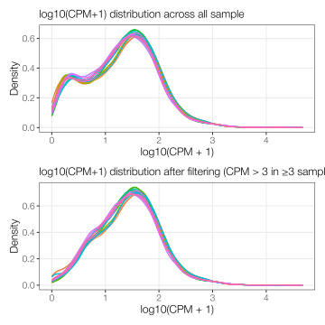
  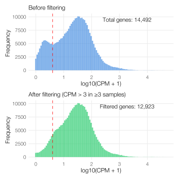
</p>

<h3>Parameters used for CPM filtering</h3>
<p>
  <strong>Criteria:</strong> &gt;3 CPM in at least 3 replicates
</p>

<pre><code class="language-r">
total_genes <- nrow(cpm_matrix)
expressed_genes <- rowSums(cpm_matrix > 3) >= 3
n_expressed <- sum(expressed_genes)
</code></pre>

## 1b. Library size comparison across all samples

<p align="center">
  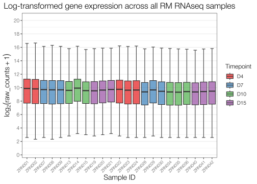
</p>

All samples appear to share similar library sizes, so there are 

## 1b. Distribution of p-values across DESeq2 contrasts of interest

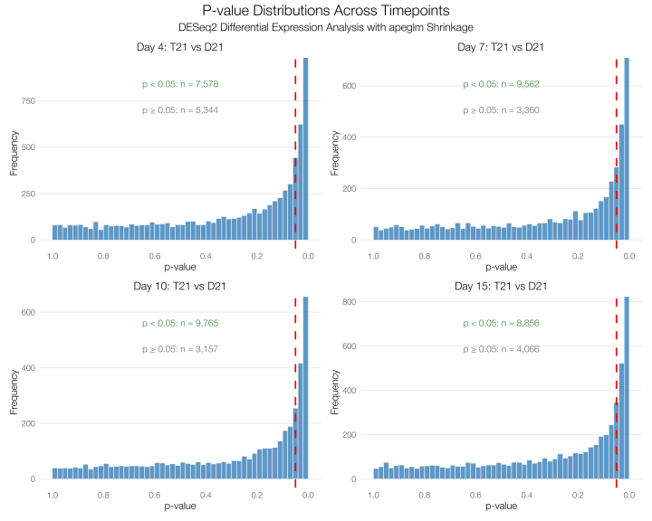

Interestingly, in the case of this experiment, our condition of interest (genotype) appears to induce a large transcriptional pertubation. ~9000 genes pass our pvalue filter of 0.05. This result is not necessarily problematic since we will apply a log2FoldChange cutoff, which should reduce potential FPs. 

## 1c. log2FoldChange scatterplots to compare effect of DESeq2's apeglm shrinkage vs. no shrinkage

<!-- QC: Shrinkage comparison -->
<p align="center">
  <a href="1-figures/quality_control/shrinkage_comparison.svg">
    
  </a>
</p>

DESeq2 offers a wi

## 1c. DESeq2 normalization assessment

<p align="center">
  
  
</p>

## 1d. sample-to-sample correlation matrix heatmap

<p align="center">
  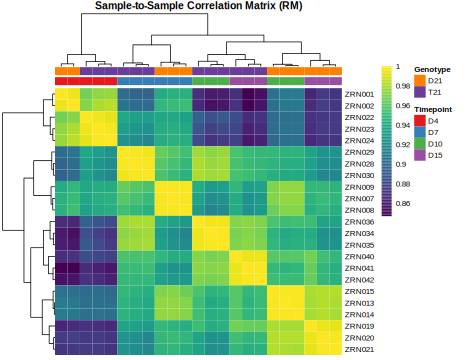
  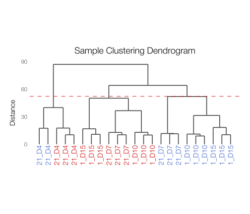
</p>

## 1e. PCA plot (with and withlout loadings + SCREE plot

<!-- PCA plots side by side -->
<p align="center">
  <a href="1-figures/quality_control/pca_plot_noloadings.svg">
    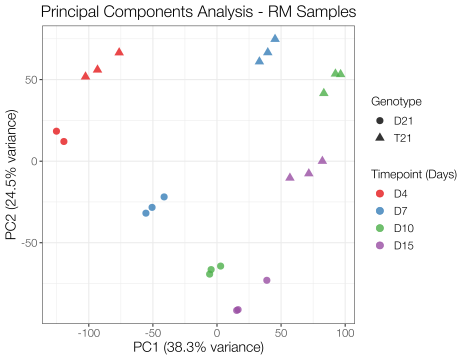
  </a>
  <a href="1-figures/quality_control/pca_plot_loadings.svg">
    
  </a>
</p>

<!-- Scree plot on its own line -->
<p align="center">
  <a href="1-figures/quality_control/scree_plot.svg">
    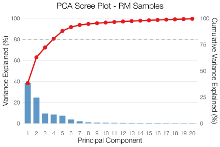
  </a>
</p>

## 1f. Gene subclass lineplot across

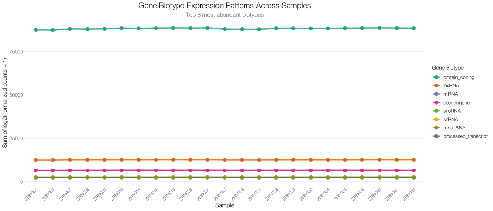

For QC purposes, this plot is likely superfluous/unnecessary. Regardless, samples with technical/sequencing issues will show an altered number of counts for a particular gene subtype. 


# Part 2: Differential gene expression analysis

## Histogram of upregulated and downregulated DEG counts for each timepoint

<p align="center">
  <a href="1-figures/differential_gene_expression/deg_histogram.svg">
    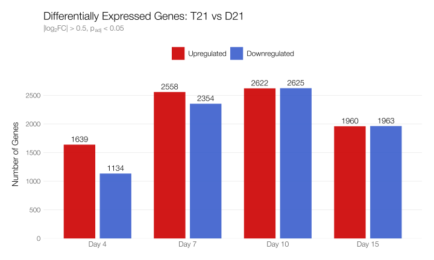
  </a>
</p>

## 2a. Volcano plots of differentially expressed genes

<p align="center">
  <a href="1-figures/differential_gene_expression/volcano_combined_2x2_T21_vs_D21.svg">
    
  </a>
</p>

## 2aa. MA plots of differentially expressed genes

<p align="center">
  <a href="1-figures/differential_gene_expression/ma_plots_T21_vs_D21.svg">
    
  </a>
</p>

## Gene ontology (GO) enrichment analysis of upregulated and downregulated differentially expressed genes

<p align="center">
  <a href="1-figures/differential_gene_expression/GO_enrichment_day4.svg">
    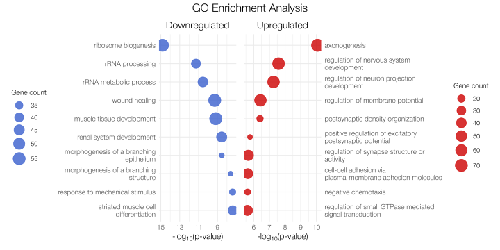
  </a>
</p>

<p align="center">
  <a href="1-figures/differential_gene_expression/GO_enrichment_day7.svg">
    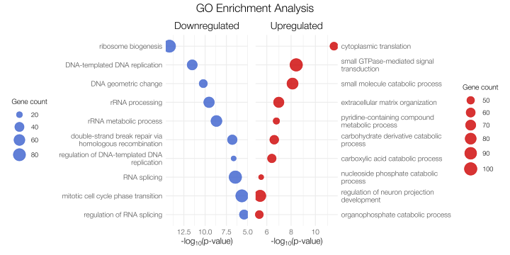
  </a>
</p>

<p align="center">
  <a href="1-figures/differential_gene_expression/GO_enrichment_day10.svg">
    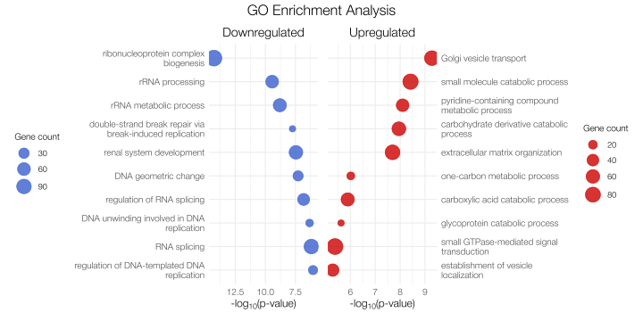
  </a>
</p>

<p align="center">
  <a href="1-figures/differential_gene_expression/GO_enrichment_day15.svg">
    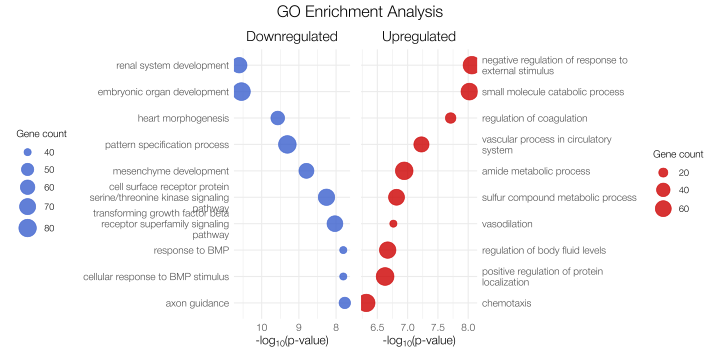
  </a>
</p>

## edgeR Counts per million (CPM) boxpltos of genes of interest over course of differentiation

## Venn diagrams of upregulated + downregulated DEGs shared across all 4 timepoints

<p align="center">
  <a href="1-figures/differential_gene_expression/upset_upregulated.svg">
    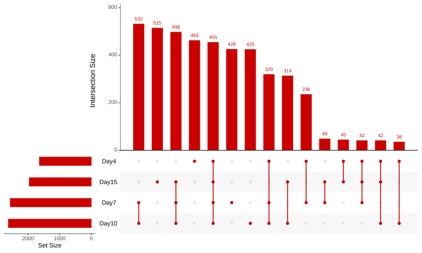
  </a>
  <a href="1-figures/differential_gene_expression/venn_upregulated.svg">
    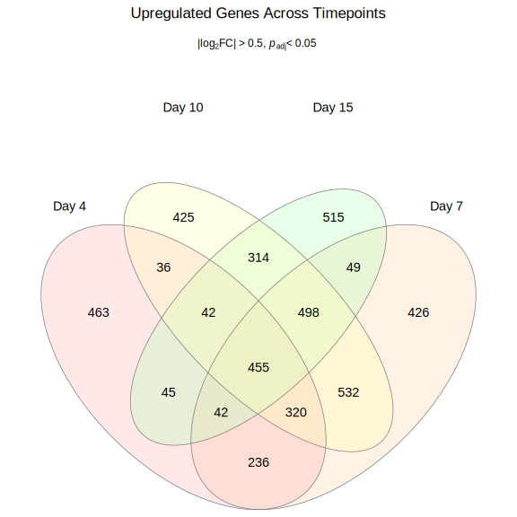
  </a>
</p>

<p align="center">
  <a href="1-figures/differential_gene_expression/upset_downregulated.svg">
    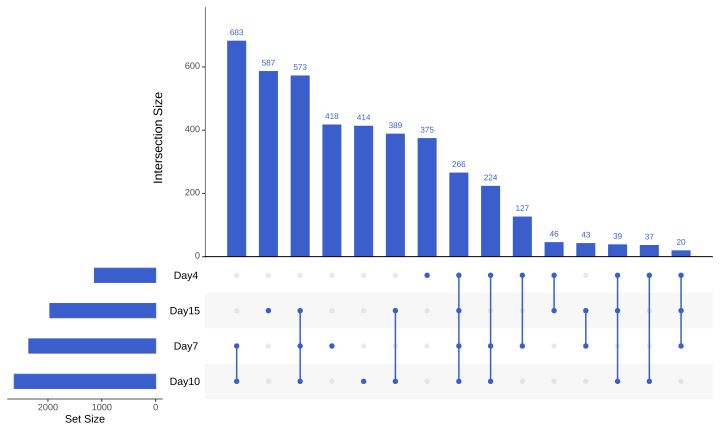
  </a>
  <a href="1-figures/differential_gene_expression/venn_downregulated.svg">
    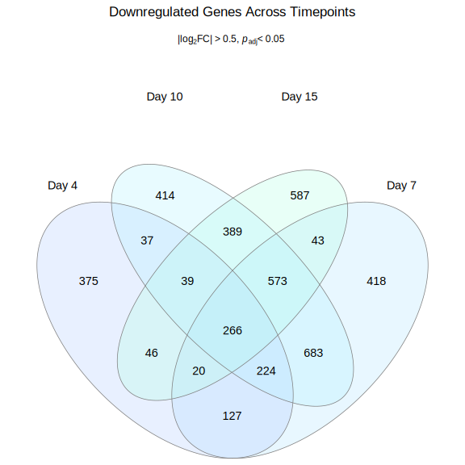
  </a>
</p>

## Aggregate gene expression lineplots to visualize change in GO term-associated gene expression over time

<p align="center">
  <a href="1-figures/differential_gene_expression/combined_lineplots_grid.svg">
    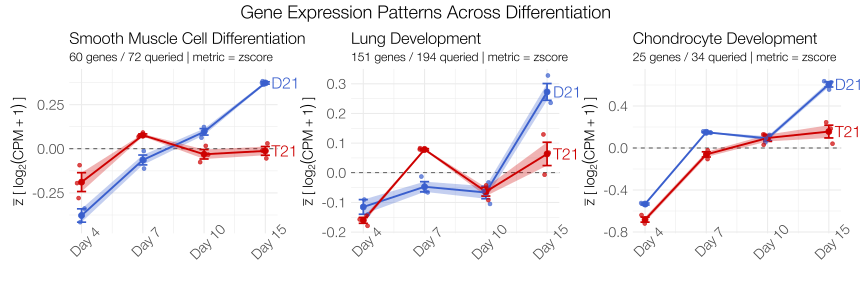
  </a>
</p>

## Heatmap of clustered gene expression and aggregate expression of each hierarchically clustered module
<p align="center">
  <a href="1-figures/differential_gene_expression/heatmap_top1000var.svg">
    
  </a>
  <a href="1-figures/differential_gene_expression/top500_variable_genes_lineplots.svg">
    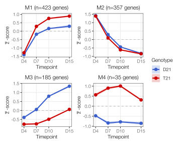
  </a>
</p>

## GSEA of custom GO lists

## CPM boxplots for genes of interest
